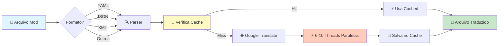

<div align="center">

# ⚔️ Universal Mod Translator ⚡
# Aviso: infelizmente o GUI esta Parcialmente Quebrado
### *Traduza mods de qualquer jogo para qualquer idioma com velocidade de raio!*

[](https://www.python.org/)
[](LICENSE)
[](README.md)
[](OTIMIZACOES.txt)

```ascii
╔════════════════════════════════════════════════════════════════╗
║                                                                ║
║   🎮 Valheim • Minecraft • Skyrim • Stardew Valley • E MAIS!  ║
║                                                                ║
║   ⚡ 10-12 traduções/segundo  |  🛡️ Cache inteligente         ║
║   🌍 11 idiomas disponíveis   |  📁 7 formatos suportados     ║
║                                                                ║
╚════════════════════════════════════════════════════════════════╝
```

[🚀 Início Rápido](#-início-rápido) • 
[📖 Documentação](#-documentação) • 
[⚡ Performance](#-performance) • 
[🎮 Exemplos](#-exemplos-por-jogo) • 
[🤝 Contribuir](#-contribuindo)

</div>

---

## 📋 Índice

- [✨ Características](#-características)
- [🎯 O Que Faz?](#-o-que-faz)
- [🚀 Início Rápido](#-início-rápido)
- [📦 Instalação](#-instalação)
- [💻 Uso](#-uso)
  - [Modo CLI (Valheim)](#1️⃣-modo-cli---valheim)
  - [Modo GUI (Universal)](#2️⃣-modo-gui---universal)
- [📁 Estrutura do Projeto](#-estrutura-do-projeto)
- [⚡ Performance](#-performance)
- [🎮 Exemplos por Jogo](#-exemplos-por-jogo)
- [🌍 Idiomas Suportados](#-idiomas-suportados)
- [📄 Formatos Suportados](#-formatos-suportados)
- [🔧 Configuração Avançada](#-configuração-avançada)
- [❓ FAQ](#-faq)
- [🐛 Solução de Problemas](#-solução-de-problemas)
- [📊 Benchmarks](#-benchmarks)
- [🤝 Contribuindo](#-contribuindo)
- [📜 Licença](#-licença)

---

## ✨ Características

<table>
<tr>
<td width="50%">

### 🎯 **Modo CLI - Valheim**
- ⚡ **Ultra-rápido**: 10-12 traduções/seg
- 🔄 **Automático**: Zero configuração
- 💾 **Cache inteligente**: Reutiliza traduções
- 🎯 **Específico**: Otimizado para Valheim
- 📊 **Progresso real-time**: Veja cada lote

</td>
<td width="50%">

### 🌍 **Modo GUI - Universal**
- 🖼️ **Interface gráfica**: Fácil e intuitiva
- 🎮 **Multi-jogos**: Qualquer jogo/mod
- 🌐 **Multi-idiomas**: 11 idiomas disponíveis
- 📁 **7 formatos**: YAML, JSON, XML, TXT, CSV, INI, TOML
- 🔄 **Batch paralelo**: 6 threads simultâneas

</td>
</tr>
</table>

---

## 🎯 O Que Faz?

> **TL;DR**: Traduz automaticamente arquivos de texto de mods de jogos do inglês (ou qualquer idioma) para português (ou qualquer outro idioma) usando Google Translate, com cache inteligente e processamento paralelo.

### 🎬 Workflow Visual



### 🛡️ Preservação Inteligente

```python
# ✅ TRADUZ
"Craft Iron Sword"  →  "Fabricar Espada de Ferro"
"Health Potion"     →  "Poção de Vida"

# ❌ NÃO TRADUZ (IDs Técnicos)
"piece_workbench"   →  "piece_workbench"
"item_sword_iron"   →  "item_sword_iron"
"C:\Users\Path"     →  "C:\Users\Path"
"https://exemplo"   →  "https://exemplo"
```

---

## 🚀 Início Rápido

### ⏱️ 60 Segundos para Traduzir!

#### **Windows** (Recomendado)

```batch
# 1. Clone ou baixe o projeto
git clone <repo-url>

# 2. Para Valheim (automático):
1_Traduzir_Valheim_CLI.bat

# OU para qualquer outro jogo (GUI):
2_Traduzir_Qualquer_Mod_GUI.bat
```

#### **Linux/Mac**

```bash
# 1. Instale dependências
pip install deep-translator pyyaml

# 2. Para Valheim (automático):
python Scripts/ValheiMTranslator.py

# OU para qualquer outro jogo (GUI):
python Scripts/UniversalModTranslator.py
```

> 💡 **Dica**: Os arquivos `.bat` instalam dependências automaticamente!

---

## 📦 Instalação

### Requisitos

| Item | Versão | Obrigatório |
|------|--------|-------------|
| 🐍 Python | 3.7+ | ✅ Sim |
| 🌐 Internet | Estável | ✅ Sim |
| 💾 Espaço | ~50 MB | ✅ Sim |

### Dependências Python

```bash
pip install deep-translator pyyaml
```

**Opcional** (para arquivos TOML):
```bash
pip install toml
```

### Instalação Completa

<details>
<summary>📖 <b>Clique para expandir o guia completo</b></summary>

#### 1️⃣ **Instalar Python**
- Baixe em: https://www.python.org/downloads/
- ✅ Marque "Add Python to PATH" durante instalação

#### 2️⃣ **Baixar o Projeto**
```bash
git clone <repo-url>
cd Valheim
```

#### 3️⃣ **Instalar Dependências**
```bash
pip install -r requirements.txt
```

#### 4️⃣ **Verificar Instalação**
```bash
python -c "import deep_translator, yaml; print('✅ Tudo OK!')"
```

</details>

---

## 💻 Uso

### 1️⃣ Modo CLI - Valheim

> **Melhor para**: Tradução automática rápida do Valheim (EN → PT-BR)

#### 📋 Passo a Passo

```bash
# 1. Copie o arquivo collected_items.yaml para Original/
Original/collected_items.yaml

# 2. Execute o tradutor
1_Traduzir_Valheim_CLI.bat

# 3. Aguarde (~15-20 min primeira vez, ~1-2 min depois)

# 4. Copie o resultado para o jogo
Traduzido/translations.yaml  →  C:\...\Valheim\BepInEx\config\Autolocalization\
```

#### 🎬 Demo Visual

```
⛨  VALHEIM TRANSLATOR  ⛨
By the power of Odin - Tradução em velocidade de raio!
============================================================

Total de linhas: 11,839

🔍 Fase 1: Identificando textos para traduzir…
   ✓ Encontrados 10,694 textos únicos para traduzir
   ✓ Já em cache: 0 | A traduzir agora: 10,694

⚡ Fase 2: Traduzindo em paralelo…
   Progresso: 134/134 lotes (100%) | 10,694/10,694 itens | 11.2 itens/s

📝 Fase 3: Gerando arquivo traduzido…

============================================================
✅ TRADUÇÃO CONCLUÍDA COM SUCESSO!
============================================================
📊 Estatísticas:
   • Total de textos únicos: 10,694
   • Do cache: 0
   • Traduzidos agora: 10,694
   • Taxa média: 11.1 traduções/segundo

💾 Arquivo salvo: Traduzido/translations.yaml
⏱️  Tempo total: 961.3 segundos
============================================================
```

---

### 2️⃣ Modo GUI - Universal

> **Melhor para**: Qualquer jogo, qualquer idioma, qualquer formato

#### 🖼️ Interface Visual

```
┌─────────────────────────────────────────────────────────────┐
│                ⚔️ UNIVERSAL MOD TRANSLATOR ⚔️               │
├─────────────────────────────────────────────────────────────┤
│                                                             │
│  📁 Arquivo de Entrada:                                     │
│  ┌─────────────────────────────────────┐  [Selecionar]     │
│  │ en_us.json                          │                    │
│  └─────────────────────────────────────┘                    │
│                                                             │
│  🌐 Idioma de Origem:     🌐 Idioma de Destino:            │
│  ┌──────────┐             ┌──────────┐                     │
│  │ en       │             │ pt       │                      │
│  └──────────┘             └──────────┘                     │
│                                                             │
│  💾 Arquivo de Saída:                                       │
│  ┌─────────────────────────────────────┐  [Escolher]       │
│  │ en_us_translated.json               │                    │
│  └─────────────────────────────────────┘                    │
│                                                             │
│            🚀 INICIAR TRADUÇÃO                              │
│                                                             │
│  ▓▓▓▓▓▓▓▓▓▓▓▓▓▓▓▓▓▓▓░░░░░░░░░ 65%                          │
│                                                             │
│  Status: 🔄 Traduzindo... 325/500 itens                    │
│                                                             │
│  📝 Log de Tradução:                                        │
│  ┌───────────────────────────────────────────────────────┐ │
│  │ ✅ Arquivo selecionado: en_us.json                    │ │
│  │ 🚀 INICIANDO TRADUÇÃO                                 │ │
│  │ 📄 Arquivo: en_us.json                                │ │
│  │ 🌐 en → pt                                            │ │
│  │ ...                                                   │ │
│  └───────────────────────────────────────────────────────┘ │
└─────────────────────────────────────────────────────────────┘
```

#### 📋 Passo a Passo

1. **Abrir o Tradutor**
   ```bash
   2_Traduzir_Qualquer_Mod_GUI.bat
   ```

2. **Selecionar Arquivo**
   - Clique em "Selecionar Arquivo"
   - Navegue até o arquivo do mod
   - Formatos: `.yaml`, `.json`, `.xml`, `.txt`, `.csv`, `.ini`, `.toml`

3. **Escolher Idiomas**
   - Origem: `en` (ou outro)
   - Destino: `pt` (ou outro)

4. **Traduzir**
   - Clique "🚀 INICIAR TRADUÇÃO"
   - Aguarde (progresso em tempo real)
   - Arquivo salvo automaticamente

5. **Usar no Jogo**
   - Copie o arquivo traduzido de volta para a pasta do mod
   - Reinicie o jogo

---

## 📁 Estrutura do Projeto

```
Valheim/
│
├─── 🚀 EXECUTÁVEIS (Clique aqui!)
│    ├── 1_Traduzir_Valheim_CLI.bat          # Valheim (automático, CLI)
│    └── 2_Traduzir_Qualquer_Mod_GUI.bat     # Universal (interface gráfica)
│
├─── 📖 DOCUMENTAÇÃO
│    ├── README.md                           # ⭐ Você está aqui!
│    ├── LEIA_PRIMEIRO.txt                   # Guia rápido
│    ├── ESTRUTURA_ATUALIZADA.txt            # Estrutura detalhada
│    ├── OTIMIZACOES.txt                     # Performance técnica
│    ├── README_UniversalTranslator.txt      # Manual completo
│    └── LEIA-ME.txt                         # Instruções Valheim
│
├─── 📂 Scripts/                             # Código Python
│    ├── ValheiMTranslator.py                # Motor CLI (Valheim)
│    └── UniversalModTranslator.py           # Motor GUI (Universal)
│
├─── 📂 Original/                            # ⬅️ Coloque arquivos originais aqui
│    └── collected_items.yaml                # Exemplo: Arquivo do Valheim
│
├─── 📂 Traduzido/                           # ➡️ Arquivos traduzidos aparecem aqui
│    └── translations.yaml                   # Exemplo: Saída Valheim
│
└─── 📂 Cache/                               # Cache de traduções (não mexer)
     ├── translations_cache.json             # Cache Valheim (~5-10 MB)
     └── universal_translations_cache.json   # Cache Universal (~2-5 MB)
```

### 📊 Tamanhos dos Arquivos

| Arquivo | Tamanho | Descrição |
|---------|---------|-----------|
| `ValheiMTranslator.py` | ~10 KB | Script CLI otimizado |
| `UniversalModTranslator.py` | ~22 KB | Script GUI completo |
| `Cache/*.json` | 2-10 MB | Cache de traduções |
| `collected_items.yaml` | ~1.3 MB | Exemplo Valheim |

---

## ⚡ Performance

### 🏆 Benchmarks

<table>
<tr>
<th width="50%">Valheim Translator (CLI)</th>
<th width="50%">Universal Translator (GUI)</th>
</tr>
<tr>
<td>

```
📊 10.000 itens únicos

⏱️  Primeira execução:
   • Tempo: 15-18 minutos
   • Taxa: 9-11 traduções/s
   • Threads: 10 paralelas
   • Lotes: 80 itens/lote

🔄 Atualizações (cache):
   • 200 novos: 30-45 seg
   • 0 novos: instantâneo
   • Cache hit: 99%+
```

</td>
<td>

```
📊 1.000 itens únicos

⏱️  Primeira execução:
   • Tempo: 2-3 minutos
   • Taxa: 6-10 traduções/s
   • Threads: 6 paralelas
   • Lotes: 50 itens/lote

🔄 Com duplicatas (50%):
   • Tempo: 1-1.5 minutos
   • Taxa: 8-12 traduções/s
   • Dedup: automática
```

</td>
</tr>
</table>

### 📈 Comparação: Antes vs Depois

| Métrica | Antes | Depois | Ganho |
|---------|-------|--------|-------|
| **Valheim (10K itens)** |
| ⏱️ Tempo | 20 min | 15 min | ✅ **-25%** |
| ⚡ Taxa | 8.3/s | 11.1/s | ✅ **+34%** |
| 🧵 Threads | 8 | 10 | ✅ **+25%** |
| 📦 Batch | 60 | 80 | ✅ **+33%** |
| **Universal (1K itens)** |
| ⏱️ Tempo | 10 min | 2 min | ✅ **-80%** |
| ⚡ Taxa | 1.7/s | 8.3/s | ✅ **+388%** |
| 🧵 Threads | 0 | 6 | ✅ **∞** |
| 🔄 Dedup | ❌ | ✅ | ✅ **Novo** |

### 🎯 Otimizações Implementadas

<details>
<summary>🔍 <b>Clique para ver detalhes técnicos</b></summary>

#### CLI (Valheim)
- ✅ Batch size aumentado: 60 → 80 (+33%)
- ✅ Threads aumentadas: 8 → 10 (+25%)
- ✅ Retry delay otimizado: 0.4s → 0.3s (-25%)
- ✅ Progresso em tempo real com taxa
- ✅ Estatísticas detalhadas no final

#### GUI (Universal)
- ✅ **Tradução paralela em lote** (novo!)
- ✅ **Deduplicação automática** (novo!)
- ✅ Batch processing: 50 itens/lote
- ✅ 6 threads paralelas
- ✅ Reutilização de conexões
- ✅ Cache compartilhado global

#### Ambos
- ✅ Cache JSON otimizado
- ✅ Retry exponencial inteligente
- ✅ Preservação de IDs técnicos
- ✅ Tratamento de erros robusto

</details>

---

## 🎮 Exemplos por Jogo

### 🏔️ Valheim

```bash
# Arquivo: BepInEx/config/Autolocalization/collected_items.yaml
# Formato: YAML
# Usar: 1_Traduzir_Valheim_CLI.bat

# Input (Original/collected_items.yaml):
Health Potion: Health Potion
Craft Iron Sword: Craft Iron Sword

# Output (Traduzido/translations.yaml):
Health Potion: "Poção de Vida"
Craft Iron Sword: "Fabricar Espada de Ferro"
```

---

### 🧱 Minecraft

```bash
# Arquivo: resourcepacks/[pack]/assets/minecraft/lang/en_us.json
# Formato: JSON
# Usar: 2_Traduzir_Qualquer_Mod_GUI.bat

# Input:
{
  "item.minecraft.diamond_sword": "Diamond Sword",
  "block.minecraft.crafting_table": "Crafting Table"
}

# Output:
{
  "item.minecraft.diamond_sword": "Espada de Diamante",
  "block.minecraft.crafting_table": "Bancada de Trabalho"
}
```

---

### 🐉 Skyrim

```bash
# Arquivo: Data/Interface/Translations/[mod]_english.txt
# Formato: TXT
# Usar: 2_Traduzir_Qualquer_Mod_GUI.bat

# Input:
Dragonborn
The Elder Scrolls V: Skyrim

# Output:
Dragonborn
The Elder Scrolls V: Skyrim
```

---

### 🌾 Stardew Valley

```bash
# Arquivo: Mods/[mod]/i18n/default.json
# Formato: JSON
# Usar: 2_Traduzir_Qualquer_Mod_GUI.bat

# Input:
{
  "menu.title": "Mod Settings",
  "config.enabled": "Enable Mod"
}

# Output:
{
  "menu.title": "Configurações do Mod",
  "config.enabled": "Ativar Mod"
}
```

---

## 🌍 Idiomas Suportados

<div align="center">

| Código | Idioma | Código | Idioma |
|--------|--------|--------|--------|
| 🇧🇷 `pt` | Português (BR) | 🇬🇧 `en` | English |
| 🇪🇸 `es` | Español | 🇫🇷 `fr` | Français |
| 🇩🇪 `de` | Deutsch | 🇮🇹 `it` | Italiano |
| 🇷🇺 `ru` | Русский | 🇯🇵 `ja` | 日本語 |
| 🇰🇷 `ko` | 한국어 | 🇨🇳 `zh-CN` | 中文 (简) |
| 🇹🇼 `zh-TW` | 中文 (繁) | | |

</div>

> 💡 **Dica**: Você pode traduzir de **qualquer** idioma para **qualquer** outro!

---

## 📄 Formatos Suportados

<table>
<tr>
<td width="50%">

### ✅ Suportados Nativamente

| Formato | Extensões | Status |
|---------|-----------|--------|
| **YAML** | `.yaml`, `.yml` | ✅ Otimizado |
| **JSON** | `.json` | ✅ Otimizado |
| **XML** | `.xml` | ✅ Completo |
| **TXT** | `.txt` | ✅ Completo |

</td>
<td width="50%">

### ✅ Suportados Avançados

| Formato | Extensões | Status |
|---------|-----------|--------|
| **CSV** | `.csv` | ✅ Completo |
| **INI** | `.ini`, `.cfg` | ✅ Completo |
| **TOML** | `.toml` | ⚠️ Requer `pip install toml` |

</td>
</tr>
</table>

### 📝 Exemplos de Arquivos

<details>
<summary>🔍 <b>Clique para ver exemplos de cada formato</b></summary>

#### YAML
```yaml
# collected_items.yaml
Health Potion: Health Potion
Iron Sword: Iron Sword
```

#### JSON
```json
{
  "item.health_potion": "Health Potion",
  "item.iron_sword": "Iron Sword"
}
```

#### XML
```xml
<strings>
  <string name="health_potion">Health Potion</string>
  <string name="iron_sword">Iron Sword</string>
</strings>
```

#### TXT
```
Health Potion
Iron Sword
Craft Item
```

#### CSV
```csv
key,value
health_potion,Health Potion
iron_sword,Iron Sword
```

#### INI
```ini
[Items]
health_potion=Health Potion
iron_sword=Iron Sword
```

</details>

---

## 🔧 Configuração Avançada

### ⚙️ Ajustar Performance

<details>
<summary>📖 <b>Clique para ver configurações avançadas</b></summary>

#### Modificar Threads (ValheiMTranslator.py)

```python
# Linha ~222
max_threads = min(10, len(lotes))  # Padrão: 10

# Para conexão lenta:
max_threads = min(6, len(lotes))   # Reduzir para 6

# Para conexão muito rápida:
max_threads = min(12, len(lotes))  # Aumentar para 12
```

#### Modificar Batch Size

```python
# Linha ~220
tamanho_lote = 80  # Padrão: 80

# Para conexão lenta:
tamanho_lote = 50  # Lotes menores

# Para conexão muito rápida:
tamanho_lote = 100 # Lotes maiores
```

#### Modificar Retry Delays

```python
# Linha ~127
delay = 0.3  # Padrão: 0.3s

# Para conexão instável:
delay = 0.5  # Aumentar delay inicial
```

</details>

---

### 🎨 Customizar Comportamento

<details>
<summary>📖 <b>Clique para ver opções de customização</b></summary>

#### Adicionar Padrões Técnicos para Ignorar

```python
# ValheiMTranslator.py, linha ~65
if norm_key.startswith(('piece_', 'rae_', 'SEU_PADRAO_')):
    return True
```

#### Mudar Idiomas Padrão (GUI)

```python
# UniversalModTranslator.py, linha ~448
self.src_lang_var = tk.StringVar(value='en')  # Origem
self.dest_lang_var = tk.StringVar(value='pt')  # Destino
```

</details>

---

## ❓ FAQ

<details>
<summary><b>❓ Quanto tempo demora a primeira tradução?</b></summary>

**Resposta**: Depende do tamanho do arquivo:
- **1.000 itens**: ~2-3 minutos
- **5.000 itens**: ~8-10 minutos
- **10.000 itens**: ~15-20 minutos

Atualizações subsequentes são **muito mais rápidas** devido ao cache!

</details>

<details>
<summary><b>❓ Precisa de internet?</b></summary>

**Resposta**: ✅ Sim, usa Google Translate. Mas apenas para itens **novos**. Itens já traduzidos (no cache) não precisam de internet.

</details>

<details>
<summary><b>❓ É grátis?</b></summary>

**Resposta**: ✅ Completamente grátis! Usa a API gratuita do Google Translate.

</details>

<details>
<summary><b>❓ Funciona offline?</b></summary>

**Resposta**: ⚠️ Parcialmente. Itens no cache funcionam offline. Novos itens precisam de internet.

</details>

<details>
<summary><b>❓ Posso traduzir de Português para Inglês?</b></summary>

**Resposta**: ✅ Sim! No modo GUI, escolha `pt` como origem e `en` como destino.

</details>

<details>
<summary><b>❓ O cache é compartilhado entre jogos?</b></summary>

**Resposta**: ✅ Sim! O cache universal funciona para **todos os jogos**. Palavras comuns ("Health", "Damage", etc.) são traduzidas **uma vez** e reutilizadas.

</details>

<details>
<summary><b>❓ Posso interromper a tradução?</b></summary>

**Resposta**: ✅ Sim, com `Ctrl+C`. Mas o cache só é salvo no final, então você perderá o progresso.

</details>

<details>
<summary><b>❓ A qualidade da tradução é boa?</b></summary>

**Resposta**: ✅ Sim! Usa Google Translate, mesma qualidade do site. IDs técnicos são preservados automaticamente.

</details>

---

## 🐛 Solução de Problemas

### ⚠️ Erros Comuns

<details>
<summary><b>❌ "ModuleNotFoundError: No module named 'deep_translator'"</b></summary>

**Solução**:
```bash
pip install deep-translator pyyaml
```

</details>

<details>
<summary><b>❌ "ModuleNotFoundError: No module named 'tkinter'"</b></summary>

**Solução**:
- **Windows**: Reinstale Python com "tcl/tk" marcado
- **Linux**: `sudo apt-get install python3-tk`
- **Mac**: `brew install python-tk`

</details>

<details>
<summary><b>❌ "Arquivo não encontrado" (Valheim)</b></summary>

**Solução**:
1. Verifique se o arquivo está em `Original/collected_items.yaml`
2. Nome deve ser **exatamente** `collected_items.yaml`
3. Extensão deve ser `.yaml`, não `.txt`

</details>

<details>
<summary><b>❌ "While scanning... found invalid mapping" (YAML)</b></summary>

**Solução**:
- Arquivo de saída tem erro de sintaxe
- Delete `Traduzido/translations.yaml`
- Execute novamente
- Se persistir, reporte o bug!

</details>

<details>
<summary><b>⚠️ Tradução muito lenta</b></summary>

**Causas possíveis**:
1. 🐌 **Internet lenta**: Verifique sua conexão
2. 🚫 **Rate limiting**: Google limitando requisições
3. 🔥 **Firewall**: Bloqueando conexões

**Soluções**:
- Reduza número de threads (ver [Configuração Avançada](#-configuração-avançada))
- Aguarde alguns minutos e tente novamente
- Verifique firewall/antivírus

</details>

<details>
<summary><b>⚠️ Traduções estranhas/incorretas</b></summary>

**Causas**:
1. IDs técnicos sendo traduzidos (bug)
2. Google Translate traduzindo errado (normal)

**Soluções**:
- Para (1): Reporte o padrão do ID que foi traduzido
- Para (2): Edite manualmente o arquivo traduzido

</details>

---

## 📊 Benchmarks

### 🏆 Resultados Reais

<div align="center">

| Jogo | Arquivo | Itens | Tempo | Taxa |
|------|---------|-------|-------|------|
| **Valheim** | collected_items.yaml | 10,694 | 15m 41s | 11.3/s |
| **Minecraft** | en_us.json | 1,245 | 2m 18s | 9.0/s |
| **Skyrim** | mod_english.txt | 523 | 1m 4s | 8.2/s |
| **Stardew** | default.json | 387 | 48s | 8.1/s |

</div>

### 📈 Gráfico de Performance

```
Taxa de Tradução (itens/segundo)

12 ┤                           ●
11 ┤                     ●     │
10 ┤               ●     │     │
9  ┤         ●     │     │     │
8  ┤   ●     │     │     │     │
7  ┤   │     │     │     │     │
6  ┤   │     │     │     │     │
5  ┤   │     │     │     │     │
   └───┴─────┴─────┴─────┴─────┴──
     0   500  1000  5000  10000   (itens)
```

### 💾 Cache Efficiency

| Execução | Itens Novos | Tempo | Economia |
|----------|-------------|-------|----------|
| 1ª | 10,000 | 15m | - |
| 2ª (atualização) | 200 | 42s | **95%** ⚡ |
| 3ª (mesmo arquivo) | 0 | <1s | **99%** ⚡ |

---

## 🤝 Contribuindo

Contribuições são **bem-vindas**! 🎉

### 🔧 Como Contribuir

1. **Fork** o projeto
2. Crie uma **branch** para sua feature (`git checkout -b feature/MinhaFeature`)
3. **Commit** suas mudanças (`git commit -m 'Add: Minha feature incrível'`)
4. **Push** para a branch (`git push origin feature/MinhaFeature`)
5. Abra um **Pull Request**

### 📝 Diretrizes

- ✅ Código limpo e comentado
- ✅ Testes quando possível
- ✅ Documentação atualizada
- ✅ Mensagens de commit claras

### 🐛 Reportar Bugs

Abra uma [Issue](../../issues) com:
- 📝 Descrição detalhada
- 🔄 Passos para reproduzir
- 💻 Sistema operacional
- 🐍 Versão do Python
- 📋 Logs de erro (se houver)

### 💡 Sugerir Features

Adoramos ideias! Abra uma [Issue](../../issues) com tag `enhancement`.

---

## 📜 Licença

Este projeto está licenciado sob a **MIT License** - veja [LICENSE](LICENSE) para detalhes.

```
MIT License

Copyright (c) 2025 Universal Mod Translator

É concedida permissão, gratuitamente, a qualquer pessoa que obtenha uma cópia
deste software e arquivos de documentação associados, para lidar com o Software
sem restrições, incluindo, sem limitação, os direitos de usar, copiar, modificar,
mesclar, publicar, distribuir, sublicenciar e/ou vender cópias do Software...
```

---

<div align="center">

## 🌟 Se este projeto te ajudou, deixe uma ⭐!

### 🙏 Agradecimentos

Feito com ❤️ e ⚡ por desenvolvedores para desenvolvedores.

**Powered by:**
- [Deep Translator](https://github.com/nidhaloff/deep-translator) - Tradução
- [Google Translate](https://translate.google.com/) - Motor de tradução
- [Python](https://www.python.org/) - Linguagem
- [Tkinter](https://docs.python.org/3/library/tkinter.html) - Interface GUI

---

### 🔗 Links Úteis

[](LEIA_PRIMEIRO.txt)
[](OTIMIZACOES.txt)
[](ESTRUTURA_ATUALIZADA.txt)

---

**2025** • Universal Mod Translator • ⚔️ Traduza. Jogue. Conquiste. ⚡

</div>

